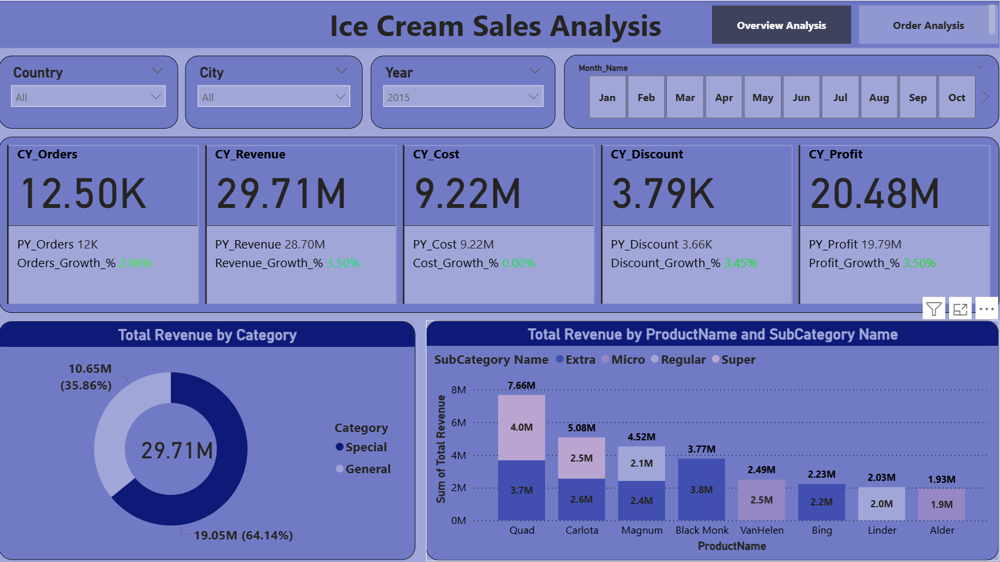
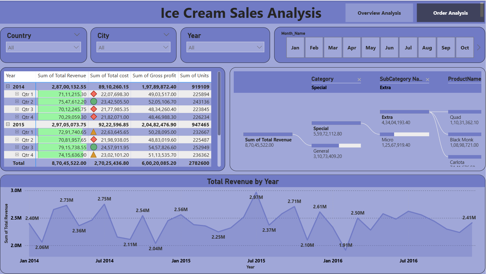

# 📊 Ice Cream Sales Analytics - Power BI Dashboard

## 🔍 Project Overview

This project is an **end-to-end Sales Analytics solution built using Power BI**, designed to transform raw, multi-year sales data into **actionable business insights**.

The focus of this project is not just on building visuals, but on following a **real-world analytics workflow** - starting from business requirement understanding (BRD & FRD), data modeling, DAX calculations, and finally creating interactive dashboards that answer key business questions.

---

## 🧾 Business Problem

The objective was to build a consolidated sales dashboard that enables stakeholders to:
- Track overall sales performance
- Compare current year vs previous year metrics
- Identify top-performing categories, subcategories, and products
- Analyze revenue trends over time
- Understand key revenue drivers at a granular level

---

## 🗂️ Dataset Description

The project uses multiple data sources, including:
- Sales data stored as **multiple yearly CSV files**
- Category, Subcategory, Product master data
- Geography and Sales Representative details

A **dynamic folder-based ingestion approach** was implemented to ensure:
- New yearly sales files are automatically included on refresh
- Removing a file does not break the data model

---

## 🧠 Data Modeling

- Designed a **star schema data model**
  - Sales table as the **fact table**
  - Product, Category, Subcategory, Geography, and SalesRep as **dimension tables**
- Created a **Date Master table** to support time intelligence calculations
- Established clean and optimized relationships to ensure accurate filtering and aggregation

---

## 📐 DAX Measures & Calculations

Key DAX measures implemented include:
- Total Revenue
- Total Cost
- Gross Profit
- Year-over-Year (YoY) Growth
- Performance comparison between time periods

These measures form the foundation for consistent and reliable business reporting.

---

## 📊 Dashboard Features

The Power BI dashboard includes:
- Business-focused KPI cards
- Category → Subcategory → Product-level analysis
- Monthly and yearly revenue trend analysis
- Decomposition Tree to identify revenue drivers
- Interactive slicers for Country, City, Year, and Month
- Custom tooltips to provide additional context without cluttering visuals

---

## 🧠 Key Learnings

- Clean data modeling simplifies complex DAX calculations
- Business requirements should drive dashboard design
- Interactive visuals and tooltips enhance user experience
- Dashboards should focus on insights, not just numbers

---

## 🛠️ Tools & Technologies

- Power BI
- DAX (Data Analysis Expressions)
- Excel & CSV data sources

---

## 🖼️ Dashboard Preview

### Overview & Performance Summary

### Product & Order Analysis

- A short screen recording demonstrating dashboard interaction and navigation available on linkedin.

---

## ▶️ How to Use This Project

1. Clone or download this repository  
2. Open the `.pbix` file using **Power BI Desktop**  
3. Ensure the dataset folder paths are correctly mapped  
4. Refresh the report to load data  

---

## 📬 Feedback

Feedback and suggestions are welcome.  
This project is part of an ongoing effort to build **real-world, business-focused analytics solutions** using Power BI.

---
## 👤 Author

**Manthan Patel**
- Linkedin: [Manthan Patel](https://www.linkedin.com/in/manthan-patel18)
- Portfolio: [yourwebsite.com](https://yourwebsite.com)
